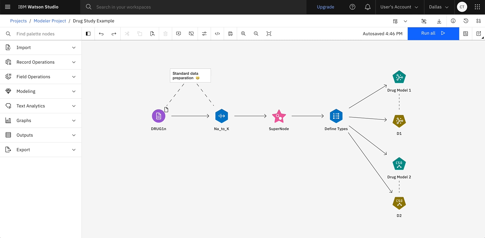

# Welcome to Elyra Canvas

Elyra Canvas is an open source library providing **React** objects to enable applications to
**quickly** create a **fully functional flow editor** allowing the user to easily create and edit
flows of linked nodes.

	
	 
	<em>Elyra Canvas in action in the SPSS Modeler UI, the flagship component of IBM Watsonx</em>

## Elyra Canvas Features

Elyra Canvas:

* Provides a **comprehensive set of out-of-the-box UI components** needed to build
an application such as: flow editor, palette, toolbar, context menu, tooltips, command stack,
clipboard support, notifications area, side panels and more!
* Is a UI-centric library and is therefore **back-end and run-time agnositc**, meaning the flow can
display connected nodes representing any kind of operations.
* Is fast to get running - and **easy to customize**  - with extensive customization capability.
* Is delivered as a package from the [**NPM registry**](https://www.npmjs.com/package/@elyra/canvas)
* Delivers a JSON powered properties management component to allow easy, no-code handling of
mulltiple properties windows - for when you have a multitude of node types each with their own range of properties.
* Conforms to the [**IBM Carbon**](https://carbondesignsystem.com/all-about-carbon/what-is-carbon/) visual design language - and therefore plugs in easily to any application wishing to follow the Carbon standards including dark mode and light mode themes.
* Delivers built-in **accessibility** so there's no need to worry about keyboard
navigation, accessible color themes, screen reader integration, etc.
* Is translated into **12 languages**.
* Is the mainstay of several IBM products/applications.

## Elyra Canvas Modules

The elyra-ai/canvas repo contains three main modules:

* [Common-Canvas](03-common-canvas.md) - This contains canvas functionality which is packaged into the [elyra/canvas NPM module](https://www.npmjs.com/package/@elyra/canvas) and deployed to the NPM registry. It provides a way for an application to display a flow of data operations (shown as a set of nodes connected with links) to the user and to allows the user to interact with the display to modify the flow. Common canvas is a react component which can be imported, and is assisted by a regular JavaScript class called `CanvasController` which provides an API and handles the internal data model of the flow. Common canvas is highly customizable where node shape and appearance, colors, styles layout etc can all be customized by your application code. Common canvas handles flows parsed from, and serialized into, a pipeline flow JSON document. It's palette of available nodes is also
customized usging a JSON document

* [Common-Properties](04-common-properties.md) - This contains properties functionality which is packaged into the [elyra/canvas NPM module](https://www.npmjs.com/package/@elyra/canvas) and deployed to the NPM registry. It provides a way to translate a JSON document, which describes a set of properties with UI hints, into a working properties dialog panel. Common properties is a React component and has an associated properties controller object.

* [Test Harness](https://github.com/elyra-ai/canvas/tree/master/canvas_modules/harness#test-harness) - This provides a node.js app which displays a UI which allows you to try out some sample applications and various features of the common canvas and common properties components. Bear in mind this is not supposed to be a fully functional app but is, as the name suggests, a framework for testing. In the test harness, you can select one of the sample applications or select `None` as the sample app and then select a test canvas file from the `Canvas Diagram` drop down list and a test palette from the `Canvas palette` drop down list.

