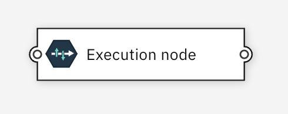
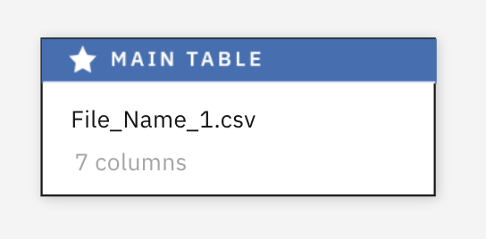

# Nodes

## Introduction

Nodes displayed in the flow editor can represent data operations or other types of
operations for the type of flow the application displays. Nodes are joined together in a flow by links (edges). Association links can also join two nodes together (in a non-directional relationship) and nodes can be connected to comments with a comment link.

Nodes can be customized into and large number of different layouts depending on the needs of the application, as shown below:

Nodes are made up of a number of display elements such as:

* an image
* a label
* a background shape
* selection highlighting
* ellipsis icon (if context menus are enabled)
* ports
* decorations

## Customization
Nodes can be customized in the following ways:

* Setting [canvas configuration](03.02.01-canvas-config/#nodes) fields
* Overrdiing CSS. A node contains the following objects with specified classes:

| Purpose      | DOM tag                             | Classes      | Notes                            |
| :---------- | :----------------------------------- | :---------- | :----------------------------------- |
|Group	        | g | d3-node-group |	Classes specified for the node in the class_name field of the node object will be added here. |
|⮕ Selection area|	path |	d3-node-selection-highlight	| |
|⮕ Outline shape	| path |	d3-node-body-outline |	 |
|⮕ Image	| svg |	d3-node-image |	 |
|⮕ Label	| foreignObject |	d3-foreign-object-node-label |	Will contain a div that contains the label text |
|⮕ Input port	| g |	d3-node-port-input |	 |
|⮕ Output port	| g |	d3-node-port-output |	 |
|⮕ Decorations	| g |	d3-node-decorations-group |	Will contain decoration elements, for example, image, path etc |

