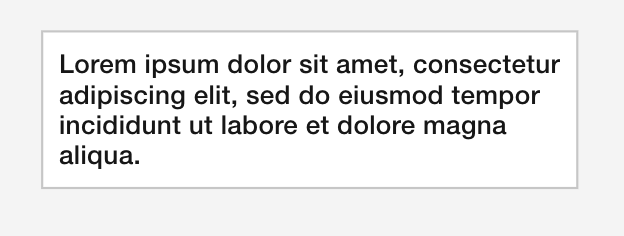
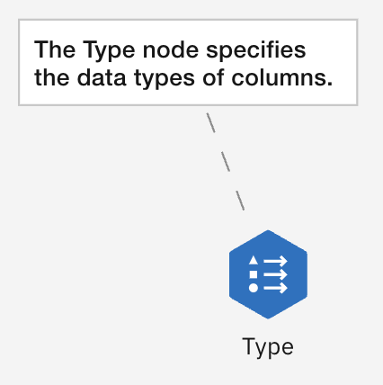
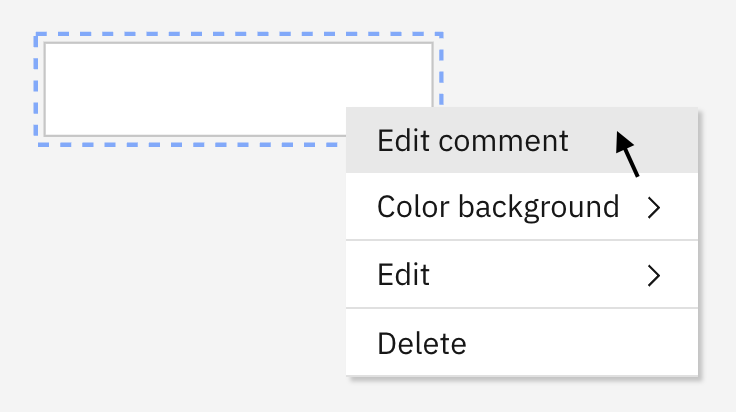
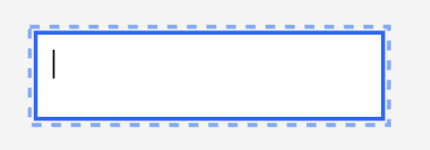
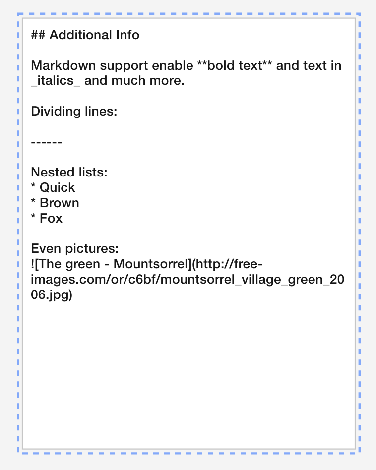
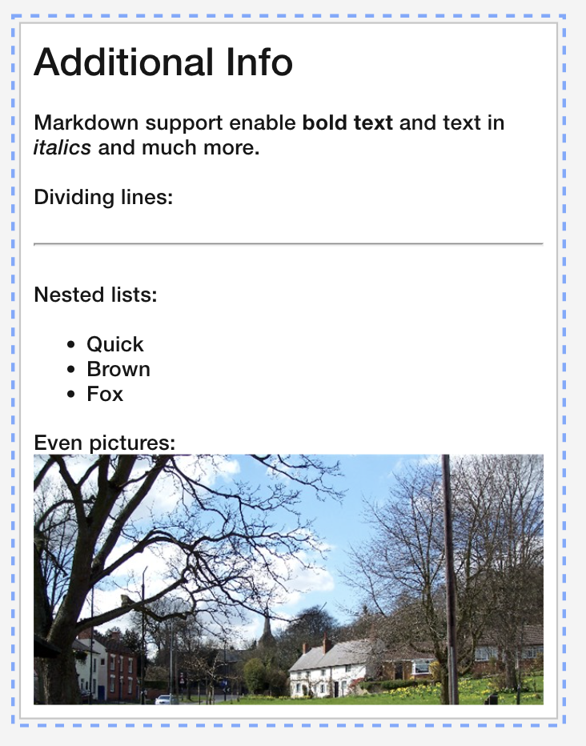

# Comments

## Introduction

Comments are used to display explanatory information to the user about the flow. Comments can be standalone:

or connected to one or more nodes with a link line:

## Creating comments

Comments can be created by the user by clicking a button on the toolbar or clicking an option in the flow editor background context menu.

| Doing this: | Yields this: |
|----| ------|
|  |  |

The comment can be edited by the user by double-clicking it or selecting an edit option from the context menu or context toolbar depending on which is enabled.

Comments can be sized by dragging the border.

## Connecting a comment to a node

By default, the connection is shown as a dashed link line. The user can create a connection by dragging the small gray blob at the bottom of the comment and dropping it onto the targte node or by selecting one of more nodes and then creating the comment. This will automatically add comment links from the comments to each selected node.

## Markdown

Optionally, the applicaton can switch on [markdown support](03.02.01-canvas-config/#enablemarkdownincomments) within comments. This allows the user to enter markdown syntax when the comment is in edit mode, which is then formated approriately in display mode.

| Entering this: | Yields this: |
|----| ------|
|  |  |

## Customization

Comments can be customized in the following ways:

* Setting the [enableMarkdownInComments](03.02.01-canvas-config/#enablemarkdownincomments) canvas configuration fields
* Overrdiing CSS. A comment contains the following objects with specified classes:

| Purpose      | DOM tag                             | Classes      | Notes                            |
| :---------- | :----------------------------------- | :---------- | :----------------------------------- |
|Group	        | g | d3-comment-group |	Classes specified for the comment in the class_name field of the node object will be added here. |
|⮕ Sizing area|	path |	d3-comment-sizing	| |
|⮕ Selection area|	path |	d3-comment-selection-highlight	| |
|⮕ Background	| path |	d3-comment-rect |	 |
|⮕ Text	| foreignObject |	d3-foreign-object-comment-text |	Will contain a div that contains the comment text |
|⮕ Decorations	| g |	d3-comment-decorations-group |	Will contain decoration elements, for example, image, path etc |

